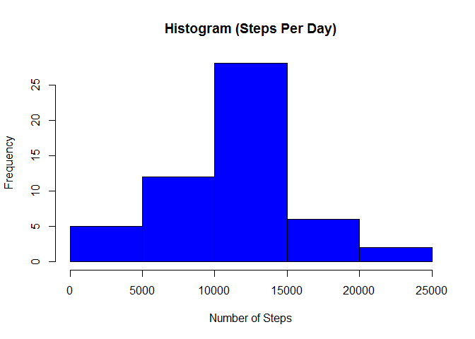
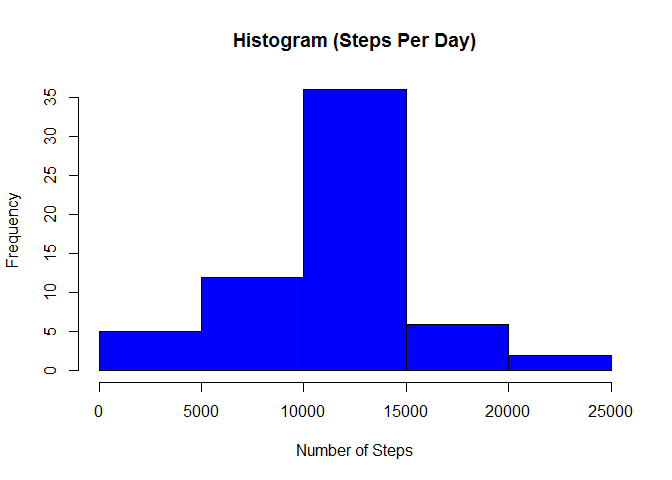

# Reproducible Research - Course Project 1
Jack Welch
October, 2016


## Introduction
This is our first project within the **Reproducible Research** course in John Hopkins University Data Science Specialization offered on Coursera. This project will introduce us to activity or fitment data collected from monitoring devices available from organizations such as FitBit, Nike, Fuelband, or Jawbone Up.  This assignment will specifically introduce us to Literate Statistical Programming whereby we can create a written report and include the analytical techniques within the body of the same document.  We will work with KnitR and we will use the R Markdown language for creating written reports with the support of R programming scripts that can produce dynamic analysis and visualization within the written report.

## Assignment Overview
The purpose of this project is to give us experience with report writing software like KnitR as well as techniques for preparing written reports as a critical component of a data analysis project:

* **Loading and preprocessing the data**
* **What is the mean total number of steps per day?**
* **What is the average daily activity pattern?**
* **Imputing missing values (NA)**
* **Differences in activity patterns between weekdays and weekends**

## Data Source
The data for this assignment is available per course instructions from the following location:

* **Dataset**: [Activity monitoring data](https://d396qusza40orc.cloudfront.net/repdata%2Fdata%2Factivity.zip) [52K]

The variables included in this dataset are:

* **steps**: Number of steps taking in a 5-minute interval (missing values are coded as `NA`)

* **Date**: The date on which the measurement was taken in YYYY-MM-DD format

* **Interval**: Identifier for the 5-minute interval in which measurement was taken

The dataset is stored in a comma-separated-value (CSV) file and there are a total of 17,568 observations in this dataset.

## Loading and preprocessing the data

If local file doesn't exist, download, unzip and load data into data frame `activity` with read.csv() method.  The data frame is the R format which makes the file suitable for analysis.  For a simple visualization of the raw data, we can output the first 10 rows of the file using the R head() function.


```r
if(!file.exists("activity.csv")) {
    temp <- tempfile()
    download.file("http://d396qusza40orc.cloudfront.net/repdata%2Fdata%2Factivity.zip", temp)
    unzip(temp)
}

activity <- read.csv("activity.csv")

head(activity, n=10)
```

```
##    steps       date interval
## 1     NA 2012-10-01        0
## 2     NA 2012-10-01        5
## 3     NA 2012-10-01       10
## 4     NA 2012-10-01       15
## 5     NA 2012-10-01       20
## 6     NA 2012-10-01       25
## 7     NA 2012-10-01       30
## 8     NA 2012-10-01       35
## 9     NA 2012-10-01       40
## 10    NA 2012-10-01       45
```

## What is mean total number of steps taken per day?
Sum steps by day, create Histogram, and calculate mean and median.  We are encouraged to ignore the NA values for the purpose of this initial analysis.


```r
dsum <- aggregate(steps ~ date, activity, sum)
hist(dsum$steps, main = paste("Histogram (Steps Per Day)"), col="blue", xlab="Number of Steps")
```

 


```r
rmean <- mean(dsum$steps)
rmedian <- median(dsum$steps)
```

The `mean` has been calculated as 1.0766189\times 10^{4}.

The `median` has been calculated as 10765.

## What is the average daily activity pattern?


```r
isum <- aggregate(steps ~ interval, activity, mean)

plot(isum$interval, isum$steps, type="l", xlab="Interval", ylab="Number of Steps", main="Average Number of Steps per Day by Interval")
```

 


```r
imax <- isum[which.max(isum$steps),1]
```

Which 5-minute interval, on average across all the days in the dataset, contains the maximum number of steps? Answer: 835

## Imputing missing values (NA)

Note that there are a number of days/intervals where there are missing values (coded as NA). The presence of missing days may introduce bias into some calculations or summaries of the data.

1. Calculate and report the total number of missing values in the dataset (i.e. the total number of rows with NAs)


```r
numNA <- sum(is.na(activity$steps))
numRows <- nrow(activity)
```
The calculated number of NA values is 2304 out of a total record count of 17568.  This represents a percentage of 13.1147541%.

2. Devise a strategy for filling in the missing values in the dataset.  Let's use the mean value for that 5 minute interval.


```r
# Find the position of each NA value
na_pos <- which(is.na(activity$steps))

# Create a vector of means
mean_vec <- rep(mean(activity$steps, na.rm=TRUE), times=length(na_pos))
```

3. Create a new dataset that is equal to the original but with the missing data filled in.


```r
# Replace the NAs with the calculated mean values
activity[na_pos, "steps"] <- mean_vec

head(activity, n=10)
```

```
##      steps       date interval
## 1  37.3826 2012-10-01        0
## 2  37.3826 2012-10-01        5
## 3  37.3826 2012-10-01       10
## 4  37.3826 2012-10-01       15
## 5  37.3826 2012-10-01       20
## 6  37.3826 2012-10-01       25
## 7  37.3826 2012-10-01       30
## 8  37.3826 2012-10-01       35
## 9  37.3826 2012-10-01       40
## 10 37.3826 2012-10-01       45
```

4. Make a histogram of the total number of steps taken each day.


```r
newdsum <- aggregate(steps ~ date, activity, sum)
hist(newdsum$steps, main = paste("Histogram (Steps Per Day)"), col="blue", xlab="Number of Steps")
```

 

Calculate a mean and median of this data set with the NA values replaced according to our chosen strategy.


```r
newrmean <- mean(newdsum$steps)
newrmedian <- median(newdsum$steps)
```

The NEW `mean` has been calculated as 1.0766189\times 10^{4}.
The original `mean` was calculated as 1.0766189\times 10^{4}.
The difference is ... 0.

The NEW `median` has been calculated as 1.0766189\times 10^{4}.
The original `median` was calculated as 10765.
The difference is ... 1.1886792.

##Differences in activity patterns between weekdays and weekends

1. Create a new factor variable in the dataset with two levels - "weekdays" and "weekend" indicating whether a given date is a weekday or weekend day.


```r
# Transform the date attribute to an actual date format
activity$date <- as.POSIXct(activity$date, format="%Y-%m-%d")

# Compute the weekdays from the date attribute
activity <- data.frame(date=activity$date, 
                           weekday=tolower(weekdays(activity$date)), 
                           steps=activity$steps, 
                           interval=activity$interval)

# Compute the day type (weekend or weekday)
activity <- cbind(activity, 
                      daytype=ifelse(activity$weekday == "saturday" | 
                                     activity$weekday == "sunday", "weekend", 
                                     "weekday"))

# Create the final data.frame
activity_new <- data.frame(date=activity$date, 
                       weekday=activity$weekday, 
                       daytype=activity$daytype, 
                       interval=activity$interval,
                       steps=activity$steps)
head(activity_new, n=10)
```

```
##          date weekday daytype interval   steps
## 1  2012-10-01  monday weekday        0 37.3826
## 2  2012-10-01  monday weekday        5 37.3826
## 3  2012-10-01  monday weekday       10 37.3826
## 4  2012-10-01  monday weekday       15 37.3826
## 5  2012-10-01  monday weekday       20 37.3826
## 6  2012-10-01  monday weekday       25 37.3826
## 7  2012-10-01  monday weekday       30 37.3826
## 8  2012-10-01  monday weekday       35 37.3826
## 9  2012-10-01  monday weekday       40 37.3826
## 10 2012-10-01  monday weekday       45 37.3826
```

2. Make a panel plot containing a time series plot (i.e. type = "l") of the 5- minute interval (x-axis) and the average number of steps taken, averaged across all weekday days or weekend days (y-axis).


```r
# Load the lattice graphical library
library(lattice)

# Compute the average number of steps taken, averaged across all daytype variable
mean_data <- aggregate(activity_new$steps, 
                       by=list(activity_new$daytype, 
                               activity_new$weekday, activity_new$interval), mean)

# Rename the attributes
names(mean_data) <- c("daytype", "weekday", "interval", "mean")

# Visualize this new data set
head(mean_data)
```

```
##   daytype  weekday interval     mean
## 1 weekday   friday        0 8.307244
## 2 weekday   monday        0 9.418355
## 3 weekend saturday        0 4.672825
## 4 weekend   sunday        0 4.672825
## 5 weekday thursday        0 9.375844
## 6 weekday  tuesday        0 0.000000
```

Here is the desired panel plot ...


```r
xyplot(mean ~ interval | daytype, mean_data, 
       type="l", 
       lwd=1, 
       xlab="Interval", 
       ylab="Number of steps", 
       layout=c(1,2))
```

 


